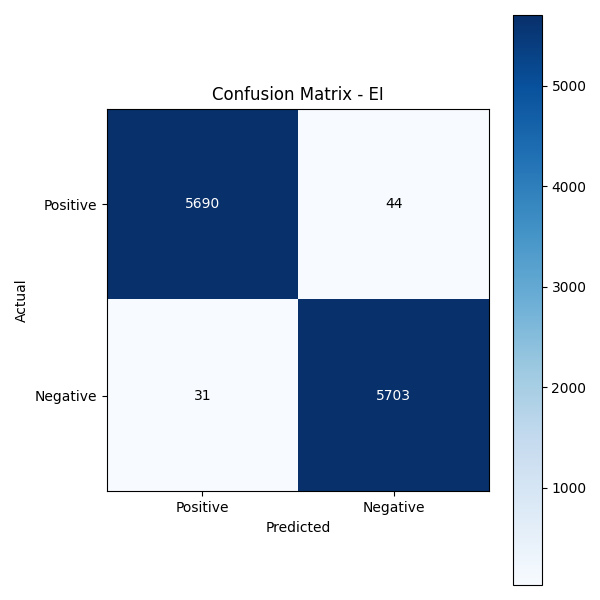
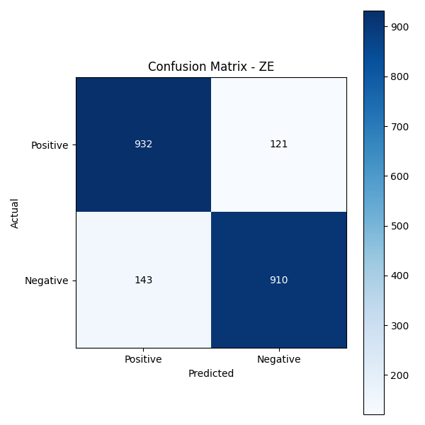
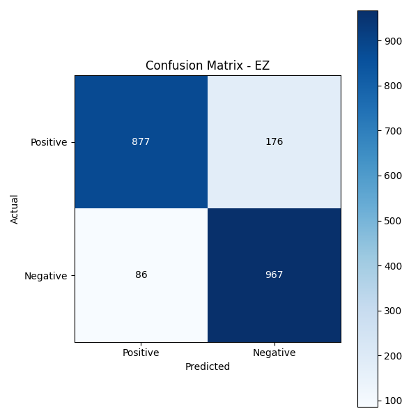
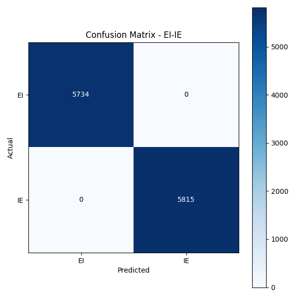
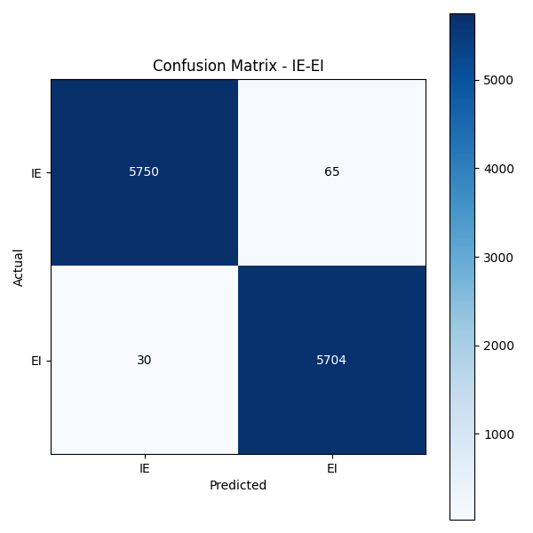
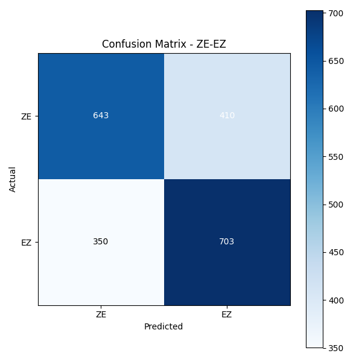

# Genomic Transition Zone Extractor

## Index

* [Project Objective](#project-objective)
* [Results](#results)
* [Installation Guide](docs/installation.md)
* [API Documentation](docs/api.md)
* [Project Structure](docs/structure.md)
* [External Data Usage](docs/data_usage.md)
* [References and Credits](docs/references.md)

## Project Objective

The objective of this project is to extract specific **genomic transition zones** from raw nucleotide strings. These transition zones include:

* **EI** – Exon → Intron transition
* **IE** – Intron → Exon transition
* **ZE** – Intergenic zone → First Exon transition
* **EZ** – Last Exon → Intergenic zone transition

Extraction is performed with a Jupyter notebook located in `data_extraction/`. The extracted transitions are saved as CSV files in `data/` and subsequently used to train several machine‑learning models.

As a final product, the project exposes a **FastAPI** endpoint that returns the probable start positions of each transition zone for any nucleotide sequence provided by the user. This capability streamlines genomic analysis and supports biological and medical research.

## Results

### Single‑class models

| Model  |  Accuracy | Precision | Recall | F1‑score |
| ------ | --------: | --------: | -----: | -------: |
| **EI** | **0.993** |     0.995 |  0.992 |    0.993 |
| **IE** | **0.939** |     0.977 |  0.900 |    0.937 |
| **ZE** | **0.875** |     0.867 |  0.885 |    0.876 |
| **EZ** | **0.876** |     0.911 |  0.833 |    0.870 |

Confusion matrices – single‑class

| EI                                            | IE                                            | ZE                                            | EZ                                            |
| --------------------------------------------- | --------------------------------------------- | --------------------------------------------- | --------------------------------------------- |
|  |  |  |  |

---

### Dual‑class models

| Model        |  Accuracy | Macro Precision | Macro Recall | Macro F1 |
| ------------ | --------: | --------------: | -----------: | -------: |
| **EI vs IE** | **1.000** |           1.000 |        1.000 |    1.000 |
| **IE vs EI** | **0.992** |           0.992 |        0.992 |    0.992 |
| **ZE vs EZ** | **0.639** |           0.640 |        0.639 |    0.639 |

Confusion matrices – dual‑class

| EI vs IE                                               | IE vs EI                                               | ZE vs EZ                                               |
| ------------------------------------------------------ | ------------------------------------------------------ | ------------------------------------------------------ |
|  |  |  |

